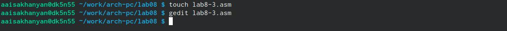

---
## Front matter
title: "Отчет по лабараторной работе №8"
subtitle: "Архитектура компьютера"
author: "Исаханян Армен Артурович"

## Generic otions
lang: ru-RU
toc-title: "Содержание"

## Bibliography
bibliography: bib/cite.bib
csl: pandoc/csl/gost-r-7-0-5-2008-numeric.csl

## Pdf output format
toc: true # Table of contents
toc-depth: 2
lof: true # List of figures
lot: true # List of tables
fontsize: 12pt
linestretch: 1.5
papersize: a4
documentclass: scrreprt
## I18n polyglossia
polyglossia-lang:
  name: russian
  options:
	- spelling=modern
	- babelshorthands=true
polyglossia-otherlangs:
  name: english
## I18n babel
babel-lang: russian
babel-otherlangs: english
## Fonts
mainfont: PT Serif
romanfont: PT Serif
sansfont: PT Sans
monofont: PT Mono
mainfontoptions: Ligatures=TeX
romanfontoptions: Ligatures=TeX
sansfontoptions: Ligatures=TeX,Scale=MatchLowercase
monofontoptions: Scale=MatchLowercase,Scale=0.9
## Biblatex
biblatex: true
biblio-style: "gost-numeric"
biblatexoptions:
  - parentracker=true
  - backend=biber
  - hyperref=auto
  - language=auto
  - autolang=other*
  - citestyle=gost-numeric
## Pandoc-crossref LaTeX customization
figureTitle: "Рис."
tableTitle: "Таблица"
listingTitle: "Листинг"
lofTitle: "Список иллюстраций"
lotTitle: "Список таблиц"
lolTitle: "Листинги"
## Misc options
indent: true
header-includes:
  - \usepackage{indentfirst}
  - \usepackage{float} # keep figures where there are in the text
  - \floatplacement{figure}{H} # keep figures where there are in the text
---

# Цель работы

Приобретение навыков написания программ с использованием циклов и обработкой
аргументов командной строки.

# Задание

Здесь приводится описание задания в соответствии с рекомендациями
методического пособия и выданным вариантом.

# Теоретическое введение

Стек — это структура данных, организованная по принципу LIFO («Last In — First Out»
или «последним пришёл — первым ушёл»). Стек является частью архитектуры процессора и
реализован на аппаратном уровне. Для работы со стеком в процессоре есть специальные
регистры (ss, bp, sp) и команды.
Основной функцией стека является функция сохранения адресов возврата и передачи
аргументов при вызове процедур. Кроме того, в нём выделяется память для локальных
переменных и могут временно храниться значения регистров.
На рис. 8.1 показана схема организации стека в процессоре.
Стек имеет вершину, адрес последнего добавленного элемента, который хранится в ре-
гистре esp (указатель стека). Противоположный конец стека называется дном. Значение,
помещённое в стек последним, извлекается первым. При помещении значения в стек указа-
тель стека уменьшается, а при извлечении — увеличивается.
Для стека существует две основные операции:
• добавление элемента в вершину стека (push);
• извлечение элемента из вершины стека (pop).
# Выполнение лабораторной работы

Создал каталог work/arch-pc/lab08 и перешел в него (рис. @fig:001).

{#fig:001 width=70%}

Создал файл в каталоге (рис. @fig:002).

{#fig:002 width=70%}

Ввел программу в файл lab8-1.asm (рис. @fig:003).

{#fig:003 width=70%}

Запустил исполнемый файл (рис. @fig:004).

{#fig:004 width=70%}

Изменил текст программы добавив изменение значение регистра ecx в цикле (рис. @fig:005).

{#fig:005 width=70%}

Редактировал программу в файле lab8-1.asm (рис. @fig:006).

{#fig:006 width=70%}

Запустил исполняемый файл и получил такой результат(рис. @fig:007).

{#fig:007 width=70%}

Внес изменения в текст программы добавив команды push и pop (рис. @fig:008).

{#fig:008 width=70%}

Запустил исполняемый файл (рис. @fig:009).

{#fig:009 width=70%}

Создал файл lab8-2.asm в том же каталоге (рис. @fig:010).

{#fig:010 width=70%}

Ввел программу в файл (рис. @fig:011).

{#fig:011 width=70%}

Запустил исполняемый файл указав его аргументы (рис. @fig:012).

{#fig:012 width=70%}

Создал файл lab8-3.asm в том же каталоге (рис. @fig:013).

{#fig:013 width=70%}

Ввел программу в файл lab8-3.asm (рис. @fig:014).

{#fig:014 width=70%}

Запустил исполняемый файл указав аргументы (рис. @fig:015).

{#fig:015 width=70%}

# Выполнение самостоятельной работы

Создал файл sam.asm для выполнения самостоятельной работы (рис. @fig:016).

{#fig:016 width=70%}

Написал программу для нахождения суммы значений функции 10(х-1) (вариант 17) (рис. @fig:017).

{#fig:017 width=70%}

Запускаю исполнямый файл c аргументами 1 и 2 (рис. @fig:018).

{#fig:018 width=70%}

# Выводы

Приобрел навыки написания программ с использованием циклов и обработкой
аргументов командной строки.

# Список литературы{.unnumbered}

::: {#refs}
:::
