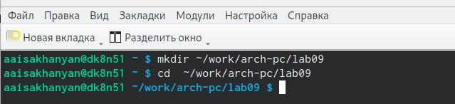
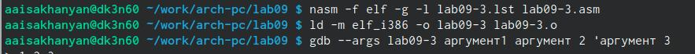

---
## Front matter
title: "Отчёт по лабораторной работе №9"
subtitle: "Архитектура компьютера"
author: "Исаханян Армен Артурович"

## Generic otions
lang: ru-RU
toc-title: "Содержание"

## Bibliography
bibliography: bib/cite.bib
csl: pandoc/csl/gost-r-7-0-5-2008-numeric.csl

## Pdf output format
toc: true # Table of contents
toc-depth: 2
lof: true # List of figures
lot: true # List of tables
fontsize: 12pt
linestretch: 1.5
papersize: a4
documentclass: scrreprt
## I18n polyglossia
polyglossia-lang:
  name: russian
  options:
	- spelling=modern
	- babelshorthands=true
polyglossia-otherlangs:
  name: english
## I18n babel
babel-lang: russian
babel-otherlangs: english
## Fonts
mainfont: PT Serif
romanfont: PT Serif
sansfont: PT Sans
monofont: PT Mono
mainfontoptions: Ligatures=TeX
romanfontoptions: Ligatures=TeX
sansfontoptions: Ligatures=TeX,Scale=MatchLowercase
monofontoptions: Scale=MatchLowercase,Scale=0.9
## Biblatex
biblatex: true
biblio-style: "gost-numeric"
biblatexoptions:
  - parentracker=true
  - backend=biber
  - hyperref=auto
  - language=auto
  - autolang=other*
  - citestyle=gost-numeric
## Pandoc-crossref LaTeX customization
figureTitle: "Рис."
tableTitle: "Таблица"
listingTitle: "Листинг"
lofTitle: "Список иллюстраций"
lotTitle: "Список таблиц"
lolTitle: "Листинги"
## Misc options
indent: true
header-includes:
  - \usepackage{indentfirst}
  - \usepackage{float} # keep figures where there are in the text
  - \floatplacement{figure}{H} # keep figures where there are in the text
---

# Цель работы

Приобретение навыков написания программ с использованием подпрограмм. Знакомство с методами отладки при помощи GDB и его основными возможностями

# Задание

Здесь приводится описание задания в соответствии с рекомендациями
методического пособия и выданным вариантом.

# Теоретическое введение

Отладка — это процесс поиска и исправления ошибок в программе. В общем случае его
можно разделить на четыре этапа:
• обнаружение ошибки;
• поиск её местонахождения;
• определение причины ошибки;
• исправление ошибки.
Можно выделить следующие типы ошибок:
• синтаксические ошибки — обнаруживаются во время трансляции исходного кода и
вызваны нарушением ожидаемой формы или структуры языка;
• семантические ошибки — являются логическими и приводят к тому, что программа
запускается, отрабатывает, но не даёт желаемого результата;
• ошибки в процессе выполнения — не обнаруживаются при трансляции и вызывают пре-
рывание выполнения программы (например, это ошибки, связанные с переполнением
или делением на ноль).
Второй этап — поиск местонахождения ошибки. Некоторые ошибки обнаружить доволь-
но трудно. Лучший способ найти место в программе, где находится ошибка, это разбить
программу на части и произвести их отладку отдельно друг от друга.
Третий этап — выяснение причины ошибки. После определения местонахождения ошибки
обычно проще определить причину неправильной работы программы.
Последний этап — исправление ошибки. После этого при повторном запуске программы,
может обнаружиться следующая ошибка, и процесс отладки начнётся заново.

# Выполнение лабораторной работы

Создание каталога lab09 и переход в него (рис. @fig:001).

{#fig:001 width=70%}

Создание файла lab09-1.asm (рис. @fig:002).

{#fig:002 width=70%}

Ввел программу в файл lab09-1.asm (рис. @fig:003).

{#fig:003 width=70%}

Запустил исполняемый файл со значением 5 (рис. @fig:004).

{#fig:004 width=70%}

Создал файл lab09-1.asm в том же каталоге (рис. @fig:005).

{#fig:005 width=70%}

Ввел программы в файл (рис. @fig:006).

{#fig:006 width=70%}

Получил исполняемый файл с ключом -g (рис. @fig:007).

{#fig:007 width=70%}

Скопировал файл lab8-2.asm в файл с именем lab09-3.asm (рис. @fig:008).

{#fig:008 width=70%}

Создал исполняемый файл, используя ключ --args для загрузки в gdb, загрузил исполняемый файл в отладчик, указав аргументы (рис. @fig:009).

{#fig:009 width=70%}

# Выполнение самостоятельной работы

Скопировал файл из 8-ой лабараторной работы для выполнения самостоятельной работы в каталог work/arch-pc/lab09 с названием sam.asm (рис. @fig:010).

{#fig:010 width=70%}

Программа для с/р 8-ой лабаратолрной работы, но с использованием подпрограмм (рис. @fig:011).

{#fig:011 width=70%}

Проверка работы программы (рис. @fig:012).

{#fig:012 width=70%}

Редактировал программу из листинга 9.3 (рис. @fig:013).

{#fig:013 width=70%}

Проверил правильность редактирования программы (рис. @fig:014).

{#fig:014 width=70%}

# Выводы

Я приобрел навыки написания программ с использованием подпрограмм. Познакомился с методами отладки при помощи GDB и его основными возможностями.

# Список литературы{.unnumbered}

::: {#refs}
:::
