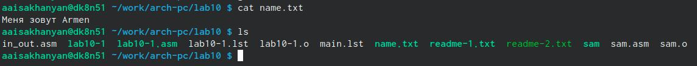

---
## Front matter
title: "Отчет по лабараторной работе №10"
subtitle: "Архитектура компьютера"
author: "Исаханян Армен Артурович"

## Generic otions
lang: ru-RU
toc-title: "Содержание"

## Bibliography
bibliography: bib/cite.bib
csl: pandoc/csl/gost-r-7-0-5-2008-numeric.csl

## Pdf output format
toc: true # Table of contents
toc-depth: 2
lof: true # List of figures
lot: true # List of tables
fontsize: 12pt
linestretch: 1.5
papersize: a4
documentclass: scrreprt
## I18n polyglossia
polyglossia-lang:
  name: russian
  options:
	- spelling=modern
	- babelshorthands=true
polyglossia-otherlangs:
  name: english
## I18n babel
babel-lang: russian
babel-otherlangs: english
## Fonts
mainfont: PT Serif
romanfont: PT Serif
sansfont: PT Sans
monofont: PT Mono
mainfontoptions: Ligatures=TeX
romanfontoptions: Ligatures=TeX
sansfontoptions: Ligatures=TeX,Scale=MatchLowercase
monofontoptions: Scale=MatchLowercase,Scale=0.9
## Biblatex
biblatex: true
biblio-style: "gost-numeric"
biblatexoptions:
  - parentracker=true
  - backend=biber
  - hyperref=auto
  - language=auto
  - autolang=other*
  - citestyle=gost-numeric
## Pandoc-crossref LaTeX customization
figureTitle: "Рис."
tableTitle: "Таблица"
listingTitle: "Листинг"
lofTitle: "Список иллюстраций"
lotTitle: "Список таблиц"
lolTitle: "Листинги"
## Misc options
indent: true
header-includes:
  - \usepackage{indentfirst}
  - \usepackage{float} # keep figures where there are in the text
  - \floatplacement{figure}{H} # keep figures where there are in the text
---

# Цель работы

Приобретение навыков написания программ для работы с файлами.

# Задание

Здесь приводится описание задания в соответствии с рекомендациями
методического пособия и выданным вариантом.

# Теоретическое введение

ОС GNU/Linux является многопользовательской операционной системой. И для обеспече-
ния защиты данных одного пользователя от действий других пользователей существуют
специальные механизмы разграничения доступа к файлам. Кроме ограничения доступа, дан-
ный механизм позволяет разрешить другим пользователям доступ данным для совместной
работы.
Права доступа определяют набор действий (чтение, запись, выполнение), разрешённых
для выполнения пользователям системы над файлами. Для каждого файла пользователь
может входить в одну из трех групп: владелец, член группы владельца, все остальные. Для
каждой из этих групп может быть установлен свой набор прав доступа. Владельцем файла
является его создатель. Для предоставления прав доступа другому пользователю или другой
группе командой
chown [ключи] <новый_пользователь>[:новая_группа] <файл>
или
chgrp [ключи] < новая_группа > <файл>
Набор прав доступа задается тройками битов и состоит из прав на чтение, запись и ис-
полнение файла. В символьном представлении он имеет вид строк rwx, где вместо любого
символа может стоять дефис. Всего возможно 8 комбинаций, приведенных в таблице 10.1.
Буква означает наличие права (установлен в единицу второй бит триады r — чтение, первый
бит w — запись, нулевой бит х — исполнение), а дефис означает отсутствие права (нулевое
значение соответствующего бита). Также права доступа могут быть представлены как вось-
меричное число. Так, права доступа rw- (чтение и запись, без исполнения) понимаются как
три двоичные цифры 110 или как восьмеричная цифра 6.

# Выполнение лабораторной работы

Создал каталог и перешел в него (рис. @fig:001).

{#fig:001 width=70%}

Создал файлы (рис. @fig:002).

{#fig:002 width=70%}

Открыл файл lab10-1.asm и ввел в него программу (рис. @fig:003).

{#fig:003 width=70%}

Создал исполняемый файл (рис. @fig:004).

{#fig:004 width=70%}

С помощью команды chmod изменил права доступа к исполняемому файлу lab10-1, запретив его выполнение (рис. @fig:005).

{#fig:005 width=70%}

С помощью команды chmod изменил права доступа к исполняемому файлу lab10-1, разрешив его выполнение (рис. @fig:006).

{#fig:006 width=70%}

Задал файлу readme-1 права использования и проверил как получилось (рис. @fig:007).

{#fig:007 width=70%}

# Выполнение самостоятельной работы

Создал файл sam.asm и ввел в него программу для выполнения самостоятельной работы (рис. @fig:008).

{#fig:008 width=70%}

Проверил программу (рис. @fig:009).

{#fig:009 width=70%}

Создал файл name.txt (рис. @fig:010).

{#fig:010 width=70%}

Проверил работу полученной программы (рис. @fig:011).

{#fig:011 width=70%}

# Выводы

Я приобрел навыки написания программ для работы с файлами.

# Список литературы{.unnumbered}

::: {#refs}
:::
